<div dir = rtl>

<div align = "center">

# بسم الله الرحمن الرحيم
## السلام عليكم ورحمة الله وبركاته
## --{ Design Patterns #1 }--

</div>

في هذا الدرس سيتم شرح ما هو الـ `Design Pattern` والـ `UML` وسيتم التفرغ لتطبيقات عملية عن الـ `pattern` في الدرس االقادم  


# `ما هو الـ Design Patterns`

هي مجموعة من الحلول للمشاكل الشائعة المتكررة في عالم البرمجة  
بمعنى انه هناك افكار ومشاريع بها بعض المشاكل الشائعة التى تتكرر دائما  
فتم عمل مجموعة من الحلول وهي الـ `Design Patterns` لحل تلك المشاكل المتكررة

يوجد العديد والعديد من الـ `Design Patterns` المختلفة وكل واحدة مخصصة لحل مشكلة او بعض المشاكل المعينة  

احيانا في المشاريع الضخمة التى تمتلك مجموعة كبيرة من الكلاسات المترابطة مع بعضها البعض  
بشكل متشابك وصعب تتبع البرنامج واحيانا يصعب التعديل عليه  
لذالك ظهرت الـ `Design Patterns` ايضا لتنظم سير المشروع  وتحل مشاكله وترتب مكوناته وتجعل البرنامج اكثر تنظيما ويسهل التعديل عليه بسلاسة  


قبل ان نبدأ بالتعرف على تلك الـ `Design Patterns` علينا ان نفهم ونتعلم الـ `UML Class Diagram` اولًا 


# `UML Class Diagram`

الـ `UML` اختصار لـ `Unified Modelling Language` ومعناها انها لغة نمذجة موحدة  
بمعنى انها لغة توصيفية للنماذج الكلاسات بشكل خاص في الـ `OOP`   
اي اننا نستخدمنها لوصف الكلاسات التى لدينا في المشروع وما المتغيرات التى يحتويه وما الدوال التى به وسواء كانت عامة او خاصة `privite` ام `public` والعلاقات ما بين الكلاسات ببعضها البعض  

هي اشبه بجداول لوصف كل كلاس وعلاقته بالكلاسات الاخرى  

دعونا نرى مثال على شكل جدول الـ `UML`  

<div dir = ltr align = "center">

|ClassName|
|:-:|
|Variables|
|Methods|

</div>

الجدول يكون شكله الاساسي هكذا  
- الصف الاول يكون `اسم الكلاس`  
- الصف الثاني يكون `المتغيرات` الخاصة بالكلاس  
- الصف الثالث يكون `الدوال` الخاصة بالكلاس  

## `المتغيرات`

المتغيرات تعريفها يكون هكذا  

<div dir = ltr>

```
Name : Datatype
```
</div>

نكتب `الاسم` ثم `:` ثم `نوع البيانات` 

لكن هذا المتغير لكي نعرفه على انه `public` او `privite` نكتب قبله اشارة `-` للـ `privite` و `+` للـ `public`  

<div dir = ltr>

```dart
- id : int
+ name : string
```
</div>

في المثال المقابل لدينا متغيرين الاول اسمه `id` من النوع `int` وهو `privite`  
والثاني اسمه `name` من النوع `string` وهو `public`  

يوجد رمزين اخران غير `+` و `-` وهما الـ `#` وهو للـ `protected` و `~` وهو للـ `package`  

ان اردنا ان نقول ونحدد ان متغير ما يكون نوعه `static`   
فنحن نضع تحته خط هكذا <u> `counter : int` </u>

- ملحوظة : الـ `static` يجعل المتغير او الدالة يتم استدعائها عن طريق `اسم الكلاس` وليس عن طريق `object` من هذا الكلاس  
  فعلى سبيل المثال ان كان لدينا كلاس يدعى `Car` ويحتوي على متغير اسمه `counter` نوعه `int` ثم جعلناه `static`   
  فنستطيع استدعاء هذا المتغير هكذا `Car::counter` دون انشاء `object` من كلاس `Car` 

  - في الـ <span dir = ltr> `C++` </span> نستخدم `Car::counter`  
  - في الـ `JAVA` نستخدم `Car.counter`


## `الدوال`

نفس الامر مع الدوال نكتبها بنفس الطريقة

<div dir = ltr>

```
VariableName(Datatype): Datatype
```
</div>

هذا هو الشكل الكامل للدوال لكن لا يجب كتابتها بشكلها الكامل دائما بل على حسب نوعية الدالة   

فناخد امثلة لنرى كيف  

<div dir = ltr>

```dart
- setName(string)
- getName() : string
```
</div>

الدالة الاولى تستقبل `string` والثانية ترجع `string` وكلايهما `privite`

ناخذ مثال حقيقي على الـ `UML` 

<div dir = ltr align = "center">

|Animal|
|:-:|
|- id : int <br> - name : string|
|+ setName(string) <br> + getName() : string|

</div>

هنا لدينا كلاس واحد يسمى `Animal` ويحتوي على متغيرين `id` و`name`  
الاول من النوع `int` والثاني من نوع `string` وكلايهما privite  
ويحتوي على دالتين الاولى `setName` وتستقبل `string` و `getName` وترجع `string` وكلايهما `public`  

الان سنوضح كيف نمثل العلاقات بين الكلاسات مع بعضها البعض  

## `Abstract Class and Interface Class`

كلاس الـ `Animal` الذي انشأناه فوق هو الكلاس الاساسي التى ستورث منه باقي الكلاسات الاخرى  
ولا يجب ان يكون له `object` لذا سنجعل كلاس الـ `Animal` يكون `Abstract Class` جعل اسم الكلاس مائلًا قليلا  
كأنك تجعله `italic` في الكتابة كهذا <i> `Animal` </i>  
او عن طريق كتابة `<<Abstract>>` فوق اسمه  

بهذا الشكل  

<div dir = ltr align = "center">

|<i> Animal </i>|
|:-:|
|- id : int <br> - name : string|
|+ setName(string) <br> + getName() : string|

او هكذا  

|<< Abstract >> <br> Animal|
|:-:|
|- id : int <br> - name : string|
|+ setName(string) <br> + getName() : string|

</div>

هكذا كلاس الـ `Animal` اصبح `Abstract Class` كلاس رئيسي يحتوي على خواص الحيونات بشكل عام  
ولا يمكن انشاء منه `Object`  
لان الـ `Abstract Class` هو كلاس يعمل كقاعدة بيانات يخزن فقط خواص وبيانات عن `"ماذا يكون الحيوان بشكل عام او بما يتكون"`  
فمنطقي انه لا يمكن انشاء منه `object` لانه ليس به وظائف او اي دالة تفاعلية هو فقط كلاس توصيفي  
يخزن فيه البيانات العامة ويتم توريثها للكلاسات الاخرى لتستخدم الدوال الخاصة بها او تعديل الدالة في حين كانت `Abstract Function`  

- ملحوظة: الـ `Abstract Function` دالة يمكن تعديلها عندما يتم وراثتها

اما في حين اردنا جعل الكلاس يكون `interface` 
نكتب  `<<Interface>>` فوق اسمه  


<div dir = ltr align = "center">

|<< Interface >> <br> Animal|
|:-:|
|- id : int <br> - name : string|
|+ setName(string) <br> + getName() : string|

</div>

### `ما الفرق بين الـ Interface والـ Abstract ؟`

- الـ `interface` مفهوم يتبع اسلوب الـ `implement` وليس الوراثة العادية  
  بمعنى انه ان قرر كلاس ما ان يأخذ كلاس `interface` وجعل العلاقة بينه وبين كلاس الـ `interface` تكون `implement`  
  فهكذا هذا الكلاس سيكون الزاميا عليه ان يعدل ويستخدم الدوال التى اخدها من كلاس `interface` لانه لم يورثها بالجعلها `implement`

- كلاس الـ `Abstract` يكون `على الاقل دالة واحدة` فقط تكون `abstract function`  
  اي اذا ورث كلاس ما كلاس الـ `Abstract` فإنه يرث كل الدوال بشكل طبيعي  
  بالاضافة انه يجب ان يعدل ويستخدم الـ `Abstract Function` التى ورثها من الـ `Abstract class`  


## `Relationships Arrows`

الان كيف نمثل العلاقات بين الكلاسات المختلفة  
هنا نستخدم الاسهم لوصف كل علاقة وكل سهم يرمز الى علاقة مختلفة  
لن اشرح كل العلاقات لانها كثيرة ومتنوعة جدا  
لذا سأشرح بعضها والاهم منها  


### - `Inheritance/Generalization Arrow`  
  
واول سهم لدينا هنا هو سهم الوراثة `Inheritance Arrow` ويطلق عليه ايضًا بـ `Generalization Arrow`

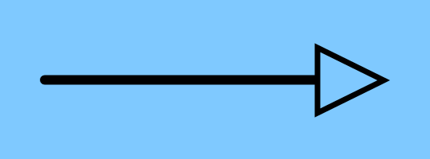

ففرضًا اننا لدينا كلاس جديد خاص للحيونات البرية وليكن اسم هذا الكلاس  `WildAnimal`  

هكذا

<div dir = ltr align = "center">

|WildAnimal|
|:-:|
|- dangerRate : int|
|+ setDangerRate(int) <br> + getDangerRate() : int|

</div>

وضفنا فيه متغير جديد يقيس معدل خطورة هذا الحيوان البري ودوال لتفاعل مع المتغير  

هذا الكلاس نريده ان يورث كلاس الـ `Animal`  
كيف نمثل هذه العلاقة بجداول ؟  

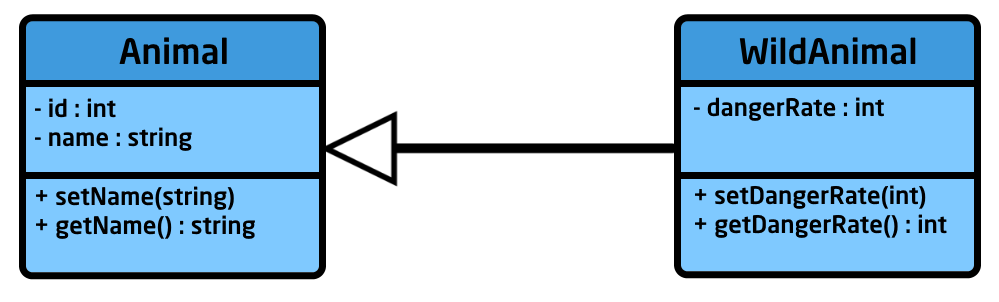

هكذا نخبره ان كلاس `WildAnimal` يرث كلاس `Animal`

### - `Dependency` 

العلاقة التانية هي الـ `Dependency` وهي الاعتمادية  
بمعنى ان قلنا ان `كلاس أ` يعتمد على `كلاس ب` فهذا يعني ان `كلاس أ لن يتواجد الى بوجود كلاس ب`

وهذا شكل السهم الذي يرمز له
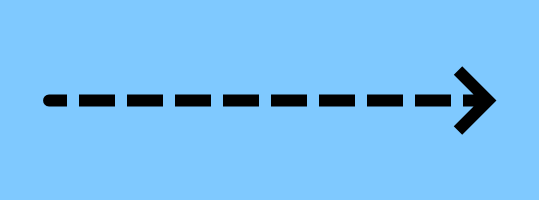

والاعتمادية تظهر بوضوح تام مع الـ `inteface` لان الكلاس الذي لديه علاقة `implement` مع 
فهكذا سيستخدم جميع الدوال بشكل اجباري  

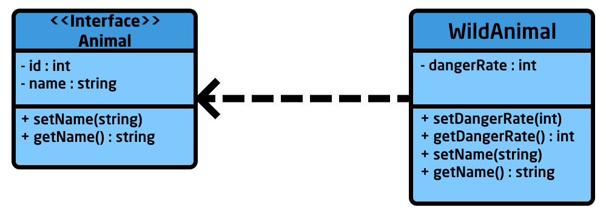

هكذا الكلاس `WildAnimal` سيأخذ ويستخدم جميع الدوال بشكل اجباري من الـ interface الـ `Animal`  
وبما ان الـ `Animal` هو `interface` فكلاس `WildAnimal` سيأخد الدالتين `setName` و`getName` عنده بشكل اجباري ليستخدمهم ويعدل عليهم  

فإذا اختفى الـ `Animal` اصبح الـ `WildAnimal` ليس له وجود  
لانه وجوده والدوال التى به تعتمد على تواجد الـ `Animal`  


### - `Association` 

هو اشبه بعلاقة توصيفية اوتعريفيه لنوع العلاقة بين الكلاسات  

سهمه له شكلان  
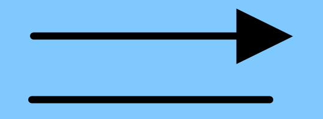

- `السهم الاول يصف علاقة باتجاه واحد فقط`  
فلو لدينا كلاس اسمه `Teacher` وكلاس يدعى `Student`  
فنقول ان المدرس يدرس للتلاميذ وليس العكس فهذه العلاقة باتجاه واحد  

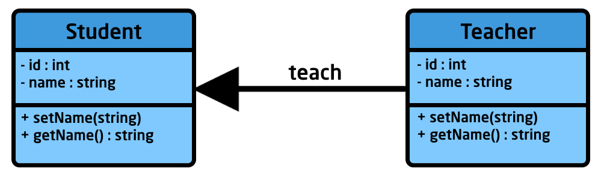

لا يوجد علاقة وراثية حقيقية بينهما لكن يوجد علاقة تصف ان المدرس يقوم بتدريس التلاميذ  

يمكننا ان نقول في المثال خاصتنا ان الحيونات البرية تأكل اللحوم  

- `السهم الاخر يصف علاقة ذو اتجهان`
  
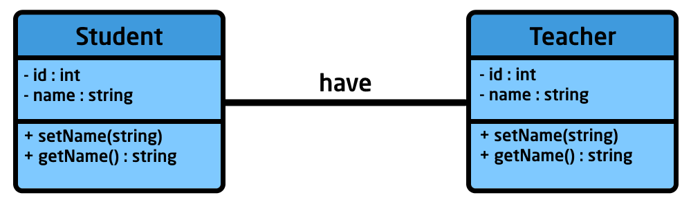

يمكننا ان نقول ان التلاميذ لديهم مدرس وان المدرس لديه تلاميذ  

يمكننا ان يعبر بعلاقة رقمية فمثلا يمكننا ان نقول ان العلاقة بين المعلم والتلميز `many to many`  
اي ان التلاميذ لديهم اكثر من استاذ  والاستاذ لديه اكثر من تلميذ  

كهذا
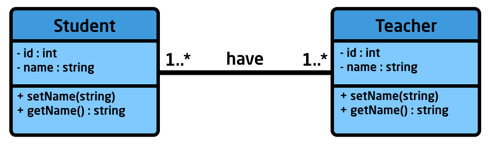

العلاقات الرقمية  
- <span dir = ltr> `1..*` </span> واحد او اكثر، على الاقل سيوجد واحد
- <span dir = ltr> `0..*` </span> صفر او اكثر، هناك احتمالية الا يوجد شيء
- <span dir = ltr> `0..1` </span> واحد او اكثر، قد يوجد واحد فقط او قد لا يوجد شيء
- `n` تستطيع ان تحدد عدد ثابت ومحدد 

### - `Aggregation` 

السهم خاصته يبدو هكذا  
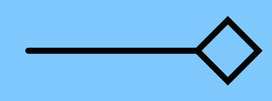

وهو يصف علاقة تكون على النحو التالي 
`الكلاس أ` قد يكون جزء من `الكلاس ب`  
لكن هذا ليس اجباريا على `الكلاس أ` فإن اختفى `ب` فسيظل `أ` كما هو لم يتغير فيه شيء  

على سبيل المثال `الشخص` قد يكون جزء من `المجتمع` او من `الاسرة`  
لكن ان اختفى `المجتمع` فيظل هذا `الشخص` كما هو لم يتأثر فيه شيء

في المثال خاصتنا يمكننا ان نقول ان `الأسد` وهو من الحيونات البرية قد يكون جزء من `القطيع`  
لكن ليس شرطا الزاميا ان يكون جزء منها، فان اختفى `القطيع` سيظهل كما هو متواجد  

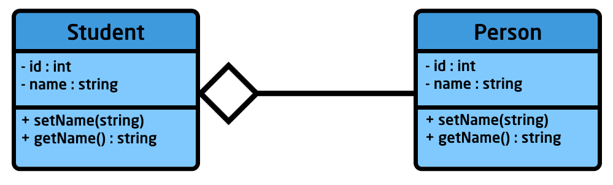

هذا المثال يحتوي على كلاس يدعى `Person` واخر يدعى `Student`  
والعلاقة هنا هي `Aggregation` من الـ `Person` للـ `Student`  
وهو يصف انه يمكن `للشخص` ان `يكون جزء` من `الطلاب` لكن هذا `ليس شرطا على كل الاشحاص`  


### - `Composition`  

السهم خاصته يبدو هكذا  

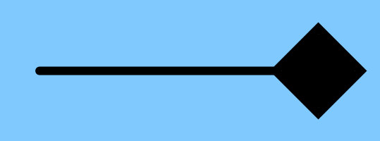

وهو يصف علاقة تكون على النحو التالي 
`الكلاس أ` يكون من مكونات بناء `الكلاس ب`  
وهذاجباري على `الكلاس أ` فإن اختفى `ب` فسيختفي `أ`  
لان كلاس أ من مكونات الكلاس ب اي انه جزء لا يتجزء منه  

فعلى سبيل المثال `البيت` يتكون من مجموعة من `الغرف` غرفة النوم والمطبخ والحمام  
فهذه `الغرف هي مكونات البيت` ان انهار البيت فكل شيء سينهار  

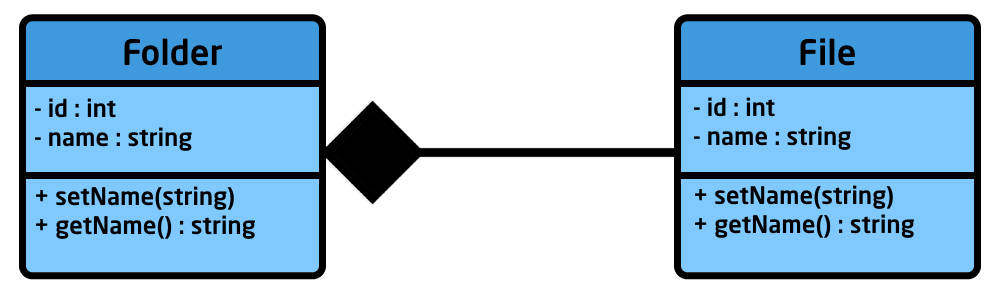

وهنا لدينا مثال اخر لتمثيل العلاقة في الجداول وهي بين `المجلد` و`الملفات`  
`المجلت` يتكون من مجموعة من `الملفات`  
ان تم حذف `المجلد` تم حذف `الملفات` معه  


هنا ينتهي الدرس  
شرحت نبذة عن اهم الاشياء في الـ `UML Class Diagram `  
وفي الدرس القادم سندخل في الـ `Design Pattern` 

</div> 