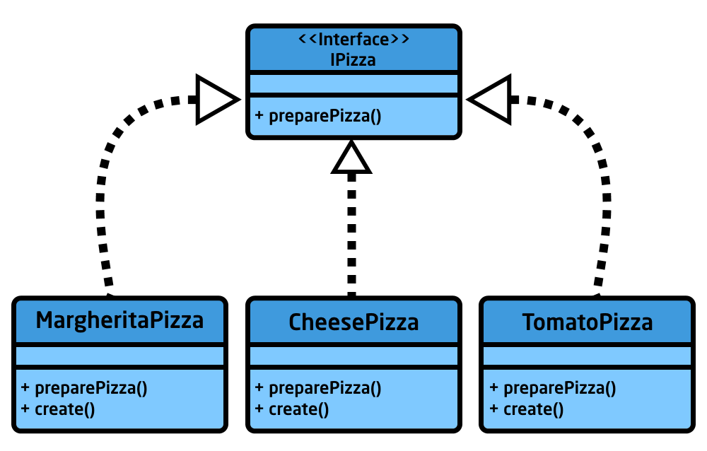
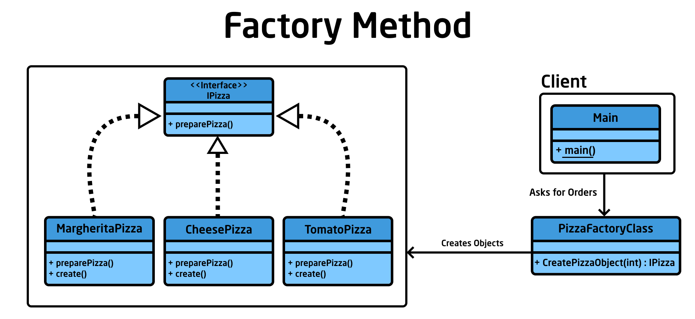

<div dir = rtl>

<div align = "center">

# بسم اللة الرحمن الرحيم
## السلام عليكم ورحمة اللة وبركاته
## --{ Factory Method Pattern }--

</div>

سنبدأ اليوم باذن اللة مع ثانى `Design Pattern` وهو `Factory Pattern`

# `ماهو Factory Design Pattern`

هو احد اشهر الـ `Creational Design Patterns` ويعد من اكثر الـ `Patterns` استخدامًا خصوصا فى لغة `Java` ويستخدم فى انشاء `كائنات` `(Objects)` مختلفة دون الحاجة الى تحديد `الفئات` `(Classes)` المختلفة الذي سننشيء منها هذه الكائنات وتتم هذه العملية عن طريقة `الواجهة` `Interface`.  
وهو ينقسم الى جزئين اساسيين وهما `Factory Method` و`Abstract Factory`  

في هذا الدرس سنشرح الـ `Factory Method`  
والدرس القادم سنشرح `Abstract Factory` ان شاء الله

## `مثال`

لنفترض اننا نقوم بانشاء نظام مطعم بيتزا والعميل فقط يقوم بطلب نوع البيتزا المطلوبة من بين الاصناف المختلفة مثل `بيتزا مارجريتا` او `بيتزا الطماطم` او `بيتزا الجبن` عن طريق ادخال `رقم الصنف`   

وسنحاول حل هذا المثال مرة بدون الـ `Factory Design Pattern` ومرة معه

- # `انشاء النظام بدون تطبيق الـ Factory Design Pattern `.

سنقوم باسناد قيم افتراضية مختلفة لكل نوع من البيتزا وبناءًا على طلب العميل سوف نقوم بانشاء البيتزا المطلوبة  
هذه القيم تكون قيم رمزية انت تحددها سواء رقمية او كلمات  


الان سنقوم بانشاء ثلاثة فئات (`Classes`) لكل نوع من انواع البيتزا وجميعهم بهم دالة واحدة وهى دالة الانشاء (`دالة للتوضيح لا اكثر`)

<div dir = "ltr">

#### `MargheritaPizza Class`

```java
public class MargheritaPizza{

    public void create(){
        System.out.println("Creating Margherita Pizza");
    }
}
```

#### `CheesePizza Class`

```java
public class CheesePizza{

    public void create(){
        System.out.println("Creating Cheese Pizza");
    }
}
```

#### `TomatoPizza Class`

```java
public class TomatoPizza{

    public void create(){
        System.out.println("Creating Tomato Pizza");
    }
}
```
</div>

الان لدنا فئة لكل نوع بيتزا `CheesePizza`, `MargheritaPizza` و`TomatoPizza`  
وكل واحدة لديها دالة تدعى `create` تطبع جملة تعريفية اننا بانشأنا بيتزا ثم يتبعها اسم النوع

والأن سوف نقوم باستخدام هذه الفئات لتنفيذ ماهو مطلوب   
وهو محاولة اعطاء للعميل البيتزا الذي يريدها عندما يدخل `رقم الطلب`  
بدون استخدام للـ `Factory Design Pattern`

لتوضيح ما لدينا الان  
شكل حزمة ملفات الفئات في الـ `Java` الان تبدو هكذا  

<div dir = "ltr">

```
Package
|
+-- Main.java
|
+-- MargheritaPizza.java
|
+-- CheesePizza.java
|
+-- TomatoPizza.java
```  

</div>

الأن كيف سيكون شكل الـ `Main` وكيف سيتم حل هذا المثال الذي عرضناه  

- ### <ins>`ملحوظة هامة:`</ins>

سوف نذكر فى باقي الشرح كلمة `Client` اكثر من مرة ونقصد بهذه الكلمة دالة الـ `main` الرئيسية الذي يبدأ منها البرنامج وليس العميل الذى يستخدم النظام.


<div dir = "ltr">

#### `Client`


```java
import java.util.Scanner;

public class Main {

    public static void main(String[] args) {
        /* Codes
            هنا نفترض ان الطلب الذي يختارة العميل يرسل علي هيئة قيم رمزية لكل طلب

            1 => Margherita
            2 => Cheese
            3 => Tomato
        */

        // الثلاثة سطور التالية تقوم باخذ رقم الطلب من العميل
        Scanner scan = new Scanner(System.in);
        System.out.print("Enter Order's Number: ");
        int order = scan.nextInt(); // order ويتم تخزين رقم الطلب في متغير الـ 

        // ننشيء كائن من كل نوع من انواع البيتزا لكي نتمكن من استخدام دالة الانشاء على حسب رقم الطلب
        MargheritaPizza margheritaPizzaObject = new MargheritaPizza();
        CheesePizza cheesePizzaObject = new CheesePizza();
        TomatoPizza tomatoPizzaObject = new TomatoPizza();

        if (order == 1)
            margheritaPizzaObject.create();
        
        else if (order == 2)
            cheesePizzaObject.create();
        
        else if (order == 3) 
            tomatoPizzaObject.create();
        
        else
            System.out.print("Not Found");
    }
}
```
</div>

## <ins>`ملخص ما فعلناه: `</ins>

قمنا بانشاء ثلاثة فئات `(Classes)` لكل نوع مختلف من البيتزا وقمنا بانشاء كائن `(Object)` من كل نوع  
وعندما يقوم العميل بطلب البيتزا نقوم بتحديد `رقم البيتزا المطلوبة ` وعن طريقه نستخدم
الكائن المناسب.

- ### `ولكن ماذا اذا اردنا ان نضيف انواع جديدة من البيتزا مثل بيتزا السجق ؟ `

سنضطر الى التعديل فى جزء الـ `Client` وهذا شيء غير محبذ لانها ببساطة ليست وظيفته.

> جزء الـ `Client` غير مسؤول عن طريقة انشاء الكائنات الخاصة بانواع البيتزا

وهنا يأتى دور الـ `Factory Pattern` حيث يرشدنا الى استخدام فئة `(Class)` يسمى على سبيل المثال `PizzaFactoryClass` يكون هو المصنع المسؤول عن انشاء `الكائن المناسب` من `الفئة المناسبه` ويرسلة الى الـ `Client`.

- # `انشاء النظام بتطبيق الـ Factory Design Pattern `.

## **1. نقوم بانشاء واجهة `(Interface)` مسؤولة عن جميع انواع البيتزا ونسميها `IPizza`**  
### **`تذكير`**

> الـ `interface` مفهوم يتبع اسلوب الـ `implement` (`التنفيذ`) وليس الوراثة العادية  
  بمعنى انه ان قررت `فئة` ما ان تنفذ `interface` اي بجعل العلاقة بينها وبين الـ `interface` تكون `implement`  
  فهكذا هذه `الفئة` ستكون ملزمة بان تعدل وتستخدم الدوال التى اخدتها من الـ `interface` لانه لم يورثها بالجعلها `implement`



الفئات الثلاثة من البيتزا ستأخد دالة الـ `preparePizza` بشكل اجباري من الـ `IPizza`

### **`ملحوظة 1`**

> جميع انواع البيتزا ستقوم بتنفيذ الـواجهة `IPizza` وبذلك نستطيع ان نقول ان كل الكائنات من كل فئات البيتزا هي من نوع `IPizza` وهذه هي فائدة هذه الواجهة لتوحيد كل الكائنات فى كائن مشترك

بمعنى انه الان يمكننا ان ننشيء كائن من `CheesePizza`, `MargheritaPizza` و`TomatoPizza` عن طريق `IPizza`  

بهذا الشكل  

<div dir = ltr>

```java
IPizza marghretaPizza = new MargheritaPizza();
IPizza cheesePizza = new CheesePizza();
IPizza tomatoPizza = new TomatoPizza();
```
</div>

اذا لم تنفذ فئات البيتزا الواجهة `IPizza`  
كنا سننشيء الكائات بهذا الشكل  

<div dir = ltr>

```java
MargheritaPizza marghretaPizza = new MargheritaPizza();
CheesePizza cheesePizza = new CheesePizza();
TomatoPizza tomatoPizza = new TomatoPizza();
```
</div>

لذلك جعلنا البيتزا تنفذ الـ `IPizza` لتوحد انواع البيتزا كما تلاحظ  


### **`ملحوظة 2`**

> ولكن يمكن فقط لهذا الكائن ان يستخدم الدوال الموجودة داخل الـواجهة فقط ليس كل دوال الكلاس


فمثلًا `tomatoPizza` لديها دالتين، دالة موجودة بها مسبقا وهي الـ `create` ودالة اخذتها من الـ `IPizza` وهي الـ `preparePizza`  

فإن انشأنا كائن عن طريق `IPizza` فلن يستطيع هذا الكائن الوصول لدالة الـ `create`  
لكن ان أنشأنا كائن من نفس نوع الفئة فنستطيع الوصول لاي دالة بها   

امثلة توضيحية
<div dir = ltr>

```java
IPizza tomatoPizza1 = new TomatoPizza();
tomatoPizza1.preparePizza(); //IPizza لن يحدث خطأ لان الدالة متواجدة في
tomatoPizza1.create(); //IPizza خطأ، لان هذه الدالة لست متواجدة في 

TomatoPizza tomatoPizza2 = new TomatoPizza();
tomatoPizza2.preparePizza(); //TomatoPizza لن يحدث خطأ لان الدالة متواجدة في
tomatoPizza2.create(); //TomatoPizza لن يحدث خطأ لان الدالة متواجدة في
```
</div>


الان هيا بنا نكمل، وننشيء الواجهة `IPizza`

<div dir = ltr>

`IPizza Interface`

```java
// هذه الواجهة سيقوم بتنفيذها كل انواع البيتزا
public interface IPizza {
    // هذه الدالة هي المسؤولة عن تحضير البيتزا
    public void preparePizza();
}
```
</div>

## **2. الان سنقوم بتنفيذ الواجهة `IPizza` فى كل فئات البيتزا**

اي ان كل نوع بيتزا سيقوم بتنفيذ هذه الواجهة بكتابة `implements IPizza` بجانب اسم الفئة  
وبالطبع كل نوع بيتزا سينفذ `IPizza` ستأخذ دالة `preparePizza` بشكل اجباري  
   
<div dir = "ltr">

#### `MargheritaPizza Class`

```java
public class MargheritaPizza implements IPizza{

    public void create(){
        System.out.println("Creating Margherita Pizza");
    }

    //IPizza أُخذت بشكل اجباري من الـ
    public void preparePizza() {
        System.out.println("Preparing Margherita Pizza");
    }
}
```

#### `CheesePizza Class`

```java
public class CheesePizza implements IPizza{

    public void create(){
        System.out.println("Creating Cheese Pizza");
    }
    
    //IPizza أُخذت بشكل اجباري من الـ
    public void preparePizza() {
        System.out.println("Preparing Cheese Pizza");
    }
}
```

#### `TomatoPizza Class`

```java
public class TomatoPizza implements IPizza{
    
    public void create(){
        System.out.println("Creating Tomato Pizza");
    }

    //IPizza أُخذت بشكل اجباري من الـ
    public void preparePizza() {
        System.out.println("Preparing Tomato Pizza");
    }
}
```
</div>


## **3. الأن ننشيء `PizzaFactoryClass` وهو المسؤول عن انشاء الكائنات المختلفة**

هذا سيكون هو المصنع الذي سيستقبل الطلب ويقوم بارجاع كائن من نوع البيتزا المطلوبة  
وهذا ما نسميه بالـ `Factory Method`  

<div dir = ltr>

```java
public class PizzaFactoryClass{
/* هذه الدالة هي من ستسقبل الطلب وسترجع كائن من نوع البيتزا المطلوبة
IPizza وبما ان انواع البيتزا التى لدينا تنفذ الـ IPizza ولاحظ ان الدالة ترجع
فهي تتشارك في نفس هذا الاسم في الانشاء كما وضحنا فوق
*/
    public IPizza CreatePizzaObject(int order){
        if(order == 1)
            return new MargheritaPizza(); // اذا كان رقم الطلب هو 1 نعيد كائن من بيتزا مارغريتا
        
        else if (order == 2)
            
            return new CheesePizza(); // اذا كان رقم الطلب هو 2 نعيد كائن من بيتزا الجبن
        
        else if (order == 3)
            
            return new TomatoPizza(); // اذا كان رقم الطلب هو 3 نعيد كائن من بيتزا الطماطم
        
        else
            return null; // الطلب ليس موجودًا
    }
}
```
</div>
 
شكل حزمة ملفات الفئات في الـ `Java` الان تبدو هكذا  

<div dir = "ltr">

```
Package
|
+-- Main.java
|
+-- PizzaFactoryClass.java (Factory Method)
|
+-- IPizza.java (interface)
|
+-- MargheritaPizza.java
|
+-- CheesePizza.java
|
+-- TomatoPizza.java
```  

</div>


## **4. نأتى لدور الـ `Client`**

الان نحن انتهينا من بناء الـ `Factory Method` ونحن مستعدون لبناء البرنامج  
دعونا نلقي نظرة على شكل الـ `UML` يخلص الـ `Factory Method`  



لدينا `Clinet` او الدالة الرئسية `main` او الشيء الذي سيقوم بتنفيذ البرنامج عليه   
نحن نحبذ ان نسميه `Client` كما قلنا  

هو سيطلب البيتزا من الـ `PizzaFactoryClass` وهو سيقوم بأخذ الطلب ثم سينشيء كائن من البيتزا حسب الطلب  
وبما ان كل انواع البيتزا من نوع `IPizza` فهكذا نوحد انواع البيتزا تحت اسم واحد  
لذا الدالة يمكنها ارجاع `IPizza` فقط بشكل عام وليس نوع بيتزا خاص 
<div dir = ltr>

`Client`

</div>

> هنا فقط نقوم بانشاء كائن من المصنع `PizzaFactoryClass` ونستخدم دالة الـ `CreatePizzaObject` لكى ننشيء كائنات على حسب رقم الـ `order` وتكون من نوع `IPizza` لذلك علينا ان ننشيء كائن من هذا النوع لاستقبال كائن البيتزا


<div dir = ltr>

```java
import java.util.Scanner;
public class Main {

    public static void main(String[] args) {
        /* Codes
            هنا نفترض ان الطلب الذي يختارة العميل يرسل علي هيئة قيم رمزية لكل طلب

            1 => Margherita
            2 => Cheese
            3 => Tomato
        */

        // الثلاثة سطور التالية تقوم باخذ رقم الطلب من العميل
        Scanner scan = new Scanner(System.in);
        System.out.print("Enter Order's Number: ");
        int order = scan.nextInt(); // order ويتم تخزين رقم الطلب في متغير الـ 

        //PizzaFactoryClass ننشيء كائن من المصنع الذي بنيناه
        PizzaFactoryClass pizzaFactory = new PizzaFactoryClass();

        //ليستقبل البيتزا IPizza ننشيء كائن من نفس نوع 
        IPizza pizzaObject;

        //ونعطيها رقم الطلب وهي سترجع لنا نوع البيتزا المطلوبة CreatePizzaObject نستدعي دالة 
        pizzaObject = pizzaFactory.CreatePizzaObject(order);
        

        //المتواجدة في كل انواع البيتزا لتقوم باي شيء نريده preparePizza نستدعي دالة
        pizzaObject.preparePizza();
     }
}
```
</div>

لنحلل هذه الاوامر  

<div dir = ltr>

> PizzaFactoryClass pizzaFactory = new PizzaFactoryClass();
</div>

ننشيء كائن  يدعى `pizzaFactory` من المصنع الذي بنيناه `PizzaFactoryClass`  
وعن طريقه سنستدعي دالة `CreatePizzaObject` التى سنأخذ الطلب وسترجع لنا نوع البيتزا على حسب الطلب  

<div dir = ltr>

> IPizza pizzaObject;
</div>

مثل قلنا كل انواع البيتزا من نوع `IPizza` ولدينا دالة `CreatePizzaObject` التى ترجع `IPizza`  
لذا انشأنا كائن يدعى `pizzaObject` من نفس نوع `IPizza` ليستقبل ويخزن البيتزا المطلوبة والراجعة من الدالة  

دعنا نشبه الـ `IPizza` بالصندوق الذي يوضع فيه البيتزا  
وعن طلب بيتزا ستأتي لنا الى المنزل فى نفس الصندوق مهما اختلف نوعها  
وهذا ما نفعله هنا نحن نعيد جميع كائنات البيتزا المختلفة على هيئة واجهة موحده `IPizza`
  
<div dir = ltr>

> pizzaObject = pizzaFactory.CreatePizzaObject(order);
</div>

نستدعي الدالة ونعطيها رقم الطلب وهي ستقوم بارجاع البيتزا المطلوبة وسيتم تخزينها في الكائن `PizzaObject`  
فنحن هنا نستخدم هذه الدالة لكي تعالج الطلب (هي اساس الـ `Factory Design Pattern`)  
وتعيد لنا كائن بيتزا مخصصة ولكن مغلف في هيئة كائن من نوعية الواجهة `IPizza`

<div dir = ltr>

> pizzaObject.preparePizza();
</div>

دالة `preparePizza` تتواجد في كل انواع البيتزا بشكل اجباري  
هي مجرد دالة افتراضية نبنيها كما نشاء لتقوم بالغرض الذي نريده  
وهي تحضير البيتزا او اي يكن ما نريده  
نحن نكتبها في كل نوع بيتزا بالشكل الذي يناسب كل نوع  

هنا ننهي درسنا للـ `Factory Method` وسنشرح في الدرس القادم الـ `Abstract Factory`
</div>
